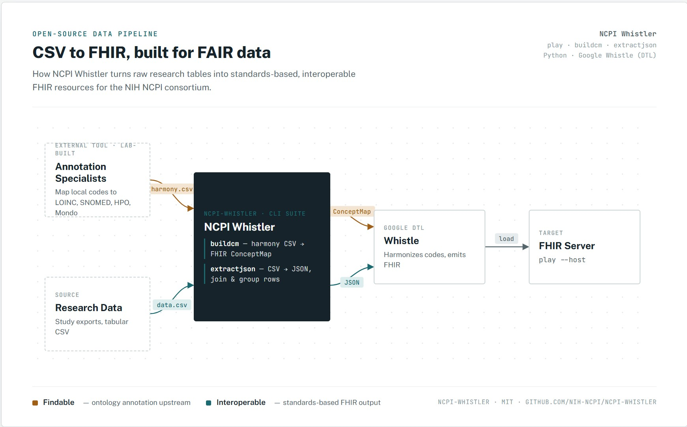

# NCPI Whistler

[](https://github.com/NIH-NCPI/ncpi-whistler/actions/workflows/tests.yml)
[](https://github.com/NIH-NCPI/ncpi-whistler/releases)
[](LICENSE)
[](docs/installation.md)
[](https://nih-ncpi.github.io/ncpi-whistler/)
[](https://github.com/NIH-NCPI/ncpi-whistler/commits/main)

NCPI Whistler is a complete pipeline that transforms research data tables into FHIR resources and loads them into a FHIR server, combining standard Python scripting, Google's [Whistle](https://github.com/GoogleCloudPlatform/healthcare-data-harmonization) data transformation language, and the FHIR REST API.

Whistle is Google's Data Transformation Language for turning arbitrary JSON into FHIR-compliant JSON. It integrates with [FHIR ConceptMaps](http://hl7.org/fhir/R4/conceptmap.html), making it a great fit for harmonizing research datasets into a consistent FHIR representation. To use Whistle, though, the data must first be JSON and any code translations must be provided as ConceptMaps — that's the gap NCPI Whistler fills, along with delivering the resulting FHIR resources into the server of your choice.

<p align="center">
  
</p>

## Quick Start

```bash
pip install .
play my_study.yaml --host dev
```

`play` is the orchestrator: given a study's YAML configuration, it builds harmony ConceptMaps, extracts the CSV data into JSON, runs it through Whistle, and (with `--host` set) loads the result into the named FHIR server. Without `--host`, it stops after generating the Whistle output so you can inspect it before loading anything.

See the [installation guide](docs/installation.md) for prerequisites (Python, Whistle itself, and its Go/Java/protobuf toolchain) and the [tutorial](https://github.com/NIH-NCPI/NCPI-Whistler-Tutorial) for a full walkthrough of setting up a study from scratch.

### Running the tests

```bash
pip install -e ".[test]"
pytest
```

### Type checking

Type hints are being added incrementally, module by module. Checked modules are enforced in CI via `mypy`; run it locally with:

```bash
pip install -e ".[dev]"
mypy
```

## How It Works

**Extraction** — Whistle transforms JSON into JSON, so the input must be JSON first. NCPI Whistler provides a YAML configuration for each dataset, used to extract data from CSV into JSON objects suitable for Whistle. Extraction also supports embedding rows from one table into another based on a shared join column (e.g. attaching a subject's observations to their record) and basic GROUP BY-style aggregation of rows within a table.

**Transformation** — NCPI Whistler converts simple CSV files into valid FHIR ConceptMaps, which Whistle uses to harmonize the various codes used throughout the dataset into common vocabularies such as LOINC, SNOMED, HPO, and Mondo.

**Load** — The load process is modular: you can load by Whistle output module or by specific resource type, so you only load what needs loading — saving time and, on cloud-hosted FHIR servers, transaction costs.

## Application Suite

NCPI Whistler installs as a suite of command-line tools, each covering a different part of the pipeline:

| Command | Purpose |
| --- | --- |
| `play` | Runs the full pipeline: builds ConceptMaps, extracts CSV, runs Whistle, and optionally loads into a FHIR server. |
| `delfhir` | Mass-deletes FHIR resources from a target server. |
| `igload` | Loads resource definitions from one or more FHIR Implementation Guides into a FHIR server. |
| `buildcm`, `extractjson`, `bundleup`, `builddd`, `inspectjson`, `init-play`, `buildsrcobs`, `buildsrcqr`, `dd-json-to-csv` | Individual pipeline steps and Whistle-projection scaffolding tools — see the [reference manual](https://nih-ncpi.github.io/ncpi-whistler/#/ref/) for each. |

## Documentation

Full documentation lives at [nih-ncpi.github.io/ncpi-whistler](https://nih-ncpi.github.io/ncpi-whistler/), including the [FHIR hosts file](docs/fhir_hosts.md), [harmony file](docs/harmony.md), and [Whistle installation](docs/whistle.md) references. See [CHANGELOG.md](CHANGELOG.md) for breaking changes and release notes.

## License

[MIT](LICENSE) © 2026 Vanderbilt University Medical Center
